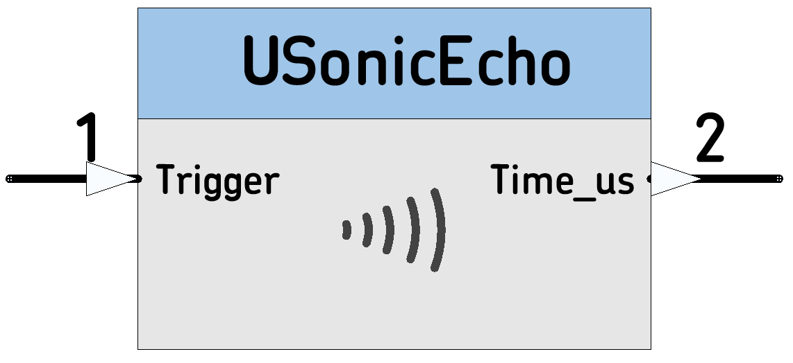

# USonicEcho

Ultrasonic distance sensor Node for the Parallax Ping
 
 *  Category: Sensor
 *  HAL: mbed
 *  Tested: with LPC1768
 *  Author: N. Chalikias

## Output data types
uint32_t: Echo time in micro-seconds

## Inputs / Outputs

 *  (Schematic pin 2) uint32_t: Echo time in micro-seconds
 *  (Schematic pin 1) Trigger Input

## Parameters:
 *  EchoPin: PinName:

## Example:
[Ticker]-->[USonicEcho]-->[StringFormat]-->[StringSerial]

